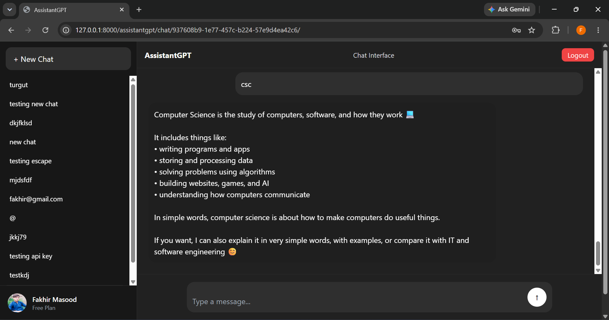

#AssistantGPT 
It is fully working chatbot like chat GPT(API based). 
which has login,logout facilities. 
It has memory and chat history facility when user register also memory facility is available while user is not signed-in.

<h2>Key Features</h2>
 <ul>
    <li>Authentication(Login/Register)</li>
    <li>Available for guest users</li>
    <li>Memory for both guest,logged-in users</li>
    <li>Maintain History for logged-in users</li>
    <li>Responsive Design</li>
</ul>

<h2>Tech Stack</h2>
<h3>Backend</h3>
<ul>
<li>Python</li>
<li>Django</li>
<li>ChatGPT API</li>
</ul>

<h3>Frontend</h3>
<ul>
<li>HTML</li>
<li>CSS</li>
<li>JS</li>
</ul>

<h3>
Database
</h3>
<ul><li>PosgreSQL</li></ul>

<h2>
Installation
</h2>
<h3>Clone the repository</h3>

git clone https://github.com/fakhirmasood-dev/Assistant-GPT 
cd assistantgpt

<h3>Create a Virtual environment</h3>

python -m venv venv 
Activate it:

<h4>Windows</h4>

venv\scripts\activate

<h4>Linux/macOS</h4>

source venv/bin/activate

<h3>Install dependencies</h3>

pip install -r requirements.txt

<h3>Apply migrations</h3>

python manage.py migrate

<h3>Run the development server</h3>

python manage.py runserver 
Open this url in browser http://127.0.0.1:8000/assistantgpt/home/

<h3>Environment Variables</h3>

create .env file and provide all environment variables.

<h1>Author</h1>
<h3>Fakhir Masood</h3>
